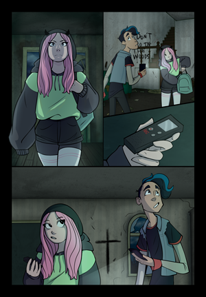
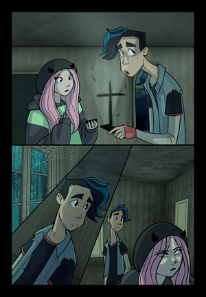

[Home](README.md)

I started drawing at the age of 13 years old. At the age of 14, I started developing an idea for a story which became the comic I'm working on today. Titled *The Haunting of Annabel Lee*, it is about a young girl investigating the disappearances of people in her hometown.
Here's a couple of small page samples!

  
  
